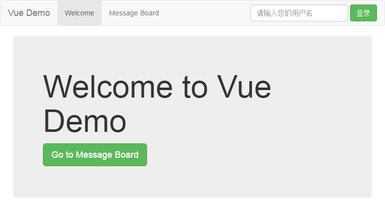

# Vue 示例项目 · 简易留言板
> ###写在前面  
> 这年头的 Demo，不是 Todo 就是 Counter，其余基本就是要多复杂有多复杂  
> 本 Demo 文档完善，注释丰满（咦？），架构精良，更重要的是简单有木有！！！  
> 如果您把玩几下后发现还行，希望您可以点颗 star  
> 如果您有任何意见或建议，请 issue，我会尽快解决与完善 ^.^

> ###更新
> 2016/8/6 &nbsp; 新增表单验证分支，详情请切换到 `vue-validator` 分支查看：```git checkout vue-validator```  
> 2016/8/7 &nbsp; 将服务挂载到顶级变量中实现即可实现可视化追踪  
> 2016/8/15 &nbsp; 使用 `definePlugin` 引入 `__DEV__`、`__PROD__` 全局环境变量  
> 2016/8/18 &nbsp; 引入 `copyWebpackPlugin` 将 `static/` 复制到 `dist/`



## 目录
#### &sect; [技术栈](#features)
#### &sect; [快速开始](#getting-started)
  * [安装](#installation)
  * [启动](#start)

#### &sect; [项目架构](#architecture)
  * [目录结构](#tree)
  * [与官方示例项目的区别](#difference)

#### &sect; [深入设计](#deep-in-design)
  * [谈谈状态管理](#state-management)
  * [引入服务层](#service-layer)
  * [Ajax](#ajax)

#### &sect; [开发](#development)
  * [Webpack 配置](#webpack-configure)
  * [开发工具](#devtools)
  * [规范](#standard)
  
#### &sect; [测试](#testing)  
#### &sect; [部署](#deployment)
#### &sect; [参考](#reference)

****

## <a name="features">&sect; 技术栈</a>
> 详情可参阅 `package.json`

* Vue 1.0.18
* Vue Router
* Ajax 请求库（Vue Resource / Superagent / jQuery-Ajax / ...）
* Webpack
* ES6 + Babel
* jQuery + BootStrap (UI)

***

## <a name="getting-started">&sect; 快速开始</a>
> 在开始前，希望您已通读如下资料  
> * [Vue.js Guide](http://cn.vuejs.org/guide/)  
> * [Vue.js API](http://cn.vuejs.org/api/)  
> * [Vue Router 文档](http://router.vuejs.org/zh-cn/index.html)  

> 同时您还需要熟悉 ES6，详情参考阮老师的[教程](http://es6.ruanyifeng.com/)

### <a name="installation">⊙ 安装</a>
> 推荐升级到 node 5.x + npm 3.x 环境  
> 推荐使用 `cnpm` 或手动切换到淘宝 npm 源  
> `npm set registry https://registry.npm.taobao.org/`

本示例项目需要结合 [简易留言板 RESTful API](https://github.com/kenberkeley/msg-board-api)  
模拟前后端分离开发（还为了与 [React Demo](https://github.com/kenberkeley/react-demo) 共用）  
请分别 `git clone`，打开**两个**命令窗口（ Windows 下推荐使用 `Cygwin`）**分别**切换到两者的目录下  
分别敲下 `npm install` 安装依赖（为避免 Windows 下的 npm 软链接问题，可加上 `--no-bin-link` 完全解构所有依赖）

### <a name="start">⊙ 启动</a>
先后在 `msg-board-api`、`vue-demo` 的命令窗口下，敲下 `npm start`  
如无意外，默认浏览器就会自动打开 `localhost:8080`，您立即可以看到效果  
若浏览器没有自动弹出，则请自行手动访问  
> 开发过程中，通过 Webpack 处理的静态资源都由基于内存的 `webpack-dev-server` 提供  
> P.S. 如果您还不清楚如何安装与启动，请看这个 [issue](https://github.com/kenberkeley/vue-demo/issues/2)

***

## <a name="architecture">&sect; 项目架构</a>
### <a name="tree">⊙ 目录结构</a>
```
.
├── build/               # Webpack 配置目录
├── dist/                # build 生成的生产环境下的项目
├── src/                 # 源码目录（开发都在这里进行）
│   ├── assets/            # 放置需要经由 Webpack 处理的静态文件
│   ├── components/        # 组件（COMPONENT）
│   ├── directives/        # 指令
│   ├── filters/           # 过滤器
│   ├── routes/            # 路由
│   ├── services/          # 服务（SERVICE）
│   ├── views/             # 路由视图基页（VIEW）
│   ├── app.js             # 启动文件
│   ├── index.html         # 静态基页
├── static/              # 放置无需经由 Webpack 处理的静态文件
├── .babelrc             # Babel 转码配置
├── .eslintignore        # （配置）ESLint 检查中需忽略的文件（夹）
├── .eslintrc            # ESLint 配置
├── .gitignore           # （配置）需被 Git 忽略的文件（夹）
├── package.json         # （这个就不用多解释了吧）
```
> 您可以根据业务需求改动目录结构。最常见的例子就是在 `src/` 新建一个 `utils/` 用于存放工具函数  
> （若 `utils/` 目录使用频繁，建议配置 [路径别名](#alias)）

### <a name="difference">⊙ 与官方示例项目的区别</a>
* 本示例项目秉承最佳实践，**高度洁癖**地实现代码分离/复用
* 优化目录结构，更好的模块分离
* 引入服务层（详细内容在下面的[深入设计·引入服务层](#service-layer)）
* 引入 [路径别名](#alias)（也就是上面的 `COMPONENT` / `SERVICE` / `VIEW`）

***

## <a name="deep-in-design">&sect; 深入设计</a>
### <a name="state-management">⊙ 谈谈状态管理</a>
Vue 参照 [Flux](https://github.com/facebook/flux) / [Redux](https://github.com/reactjs/redux)，实现出 [Vuex](https://github.com/vuejs/vuex)，专注于**应用层级**的状态管理。
本示例项目并没有引入 Vuex ，主要是基于以下考量：

如果您看过文档中的[简易教程 · 计数器](http://vuex.vuejs.org/zh-cn/tutorial.html)，您应该会觉得 Vuex 把简单问题复杂化了（的确如此）。为了实现全局状态管理，把原本简单纯粹的双向绑定以及操作方法都剥离开来，抽象成 Vuex 的 `state / mutation / action`。对于绝大部分中小型项目而言，这显然是过度设计，牛刀杀鸡。

对于这个问题，作者尤雨溪有如下[评述](http://vuex.vuejs.org/zh-cn/intro.html)：
> &nbsp;&nbsp;&nbsp;当你的应用还很简单的时候，你多半并不需要 Vuex。也不建议过早地使用  Vuex。但如果你正在构建一个中型以上规模的 SPA，你很有可能已经需要思考应该如何更好地归纳 Vue 之外，应用的其他组成部分。这就是 Vuex 要大显身手的时刻。  
&nbsp;&nbsp;&nbsp;我们在单独使用 Vue.js 的时候，通常会把状态储存在组件的内部。也就是说，每一个组件都拥有当前应用状态的一部分，整个应用的状态是分散在各个角落的。然而我们经常会需要把状态的一部分共享给多个组件。一个常见的解决策略为：使用定制的事件系统，让一个组件把一些状态“发送”到其他组件中。这种模式的问题在于，大型组件树中的事件流会很快变得非常繁杂，并且调试时很难去找出究竟哪错了。  
&nbsp;&nbsp;&nbsp;为了更好的解决在大型应用中状态的共用问题，我们需要对组件的 组件本地状态(component local state) 和 应用层级状态(application level state) 进行区分。应用级的状态不属于任何特定的组件，但每一个组件仍然可以监视（Observe）其变化从而响应式地更新 DOM。通过汇总应用的状态管理于一处，我们就不必到处传递事件。因为任何牵扯到一个以上组件的逻辑，都应该写在这里。此外，这样做也能让我们更容易地记录并观察状态的变更（Mutation，原意为突变），甚至可以实现出华丽如时光旅行一般的调试效果。

React 作为一个 View 层，不具备数据的双向绑定能力，其数据流是单向的。既然是**单向数据流**，那么将整个应用状态汇于一处集中管理（这就是传统意义上的 Model 层，只是改名为 Store 层罢了），抽离出操作方法等（Controller 层，在此为 Action 与 Reducer 层），也是自然而然的。这是基于大型项目协作开发中，前人踩坑后的最佳经验总结，同时也是当前前端 MVC 的最佳实践。

但 Vue 乃轻量级的 MVVM 框架，若完全照搬相对抽象的 React + Flux / Redux 架构，未免有点舍本逐末了。私认为，对于一个使用 MVVM 模式构建的单页应用而言，需要置于 `store` 层的，仅限于**全局通用**且**状态持久**的数据（例如用户认证信息）。若把所有应用数据（尤指一些实时性较高的数据以及非共享的数据）都糅合在一处，那就像是把所有变量都挂载到全局。

结合作者尤雨溪的说法，Vue 状态管理的最佳实践应为：**组件自包含状态数据（组件本地状态），全局持久性通用数据（应用层级状态）集中管理**。

可是，**全局通用**且**状态持久**的数据占极少数，若为此而引入 Vuex，实在是太不值得了。这个时候，就需要借鉴 AngularJS 的一些经验实践来实现 Vuex 的功能。

### <a name="service-layer">⊙ 引入服务层</a>
> 您无需有 Angular 的开发经验，因为 Vue 本身就是 Angular 的优雅简化版

在 Angular 中，组件间的数据传递一般是使用服务（Service），有时也会使用事件传递。若是全局通用（包括模板中）需要用到的状态数据，就挂载到 `$rootScope` 上。参照上述实践，我们让 Vue 的根组件 `App`（位于 `src/components/App.vue`）充当 `$rootScope`，直接把**全局通用**的数据挂载到根组件的 `data` 属性上。这样一来，在子组件中直接使用 `this.$root` 即可访问。同样地，**全局单例**的 Service 也可存储数据，也是直接挂载到其 data 属性即可。
> 例如，本示例中，根组件 `App` 与 `userService.data` 均存储着用户的 session  
> （二者是**手动**同步的，详情请看 `src/components/Navbar/` 下的 `LoginForm.vue` / `LogoutDropDown.vue`）  
> 但 `App` 的仅能在组件内部通过 `this.$root.userData` 访问  
> 而 `userService` 的则可以在**任何地方**访问（见 `src/routes/index.js`）  
> 仅需要 `import userService from 'SERVICE/userService'` 即可

虽说 Service 可以存储数据，但这并不是它主要的功能。皆因开发过程中，使用 Vue DevTools 是无法直接查看 Service 中挂载的数据，亦即 Service 中的数据具有一定的**不可追踪性**。因此，对于那些**状态毋须持久**的数据（例如表单项），请直接存储在组件内部（`data`）。
在组件间的传递这些数据，也可以直接使用事件传递 `dispatch` 或父子组件间的 `props` 即可。
> 实际上可以在根组件 `App` 中的 `data` 属性实现追踪，举例如下：  
> ```data: { userData: null, userService }```  
> (但本项目中 `this.$root.userData` 与 `userService.data` 一直保持手动同步，故上述操作非必要)

Service 在 Angular 中还有一个很重要的作用，就是封装 Ajax 请求。
> 例如，小明和小刚分工合作一个项目，分别负责 Foo 与 Bar 模块  
> 在 Foo 的控制器中，需要请求用户 session，于是小明自己在控制器中引入 `$http` 请求  
> 在 Bar 的控制器中，又需要请求用户 session，于是小刚又自己写了一遍  
> 这其实有点像在后端开发中，将 M 层的代码直接写在 C 层，导致代码冗余揉杂，复用率低  
> 因此在 Angular 中，在控制器中实现 Ajax 请求是反模式，应当把这部分封装成 Service 以便复用

在本示例项目中，Service 层的主要功能是：**封装好与后端 API 一一对应的函数。**
> 例如，后端用于用户登录的API为 `/login`  
> 那么前端 `services/userService.js` 这个服务类中就对应存在一个名为 `login` 的函数  
> 只需要调用 `userService.login({ 用户帐号密码 })` 即可实现请求

引入服务层的主要作用就是为了**轻量化组件，统一管理 XHR 请求，提高代码复用，方便 mock**，避免在组件中分别实现请求而导致管理上的混乱（对日后的重构也不友好）。而且，**前端的服务与后端的 API 一一对应**，在理解上也会变得更加容易。

更重要的是，服务层与 Vue 技术栈并没有太大关系（前提是您没有用 Vue Resource）。  
以后前端改用其他技术栈（React 等）时，服务层可直接复制过去，毋须改动任何代码。
> [React Demo](https://github.com/kenberkeley/react-demo) 就是直接复制本示例项目的 `services/` 目录

您可能会觉得，这是要把 Vue 当 Angular 使的节奏，的确如此。不管黑猫白猫，能捉到老鼠的就是好猫。  
同样，Angular 虽被喷复杂，但其经验确实有助于大型项目的开发与维护。故汲取其精髓，何乐而不为？

### <a name="ajax">⊙ Ajax</a>
本示例项目封装出统一的 `xhr` 函数提供 Ajax 请求：

```javascript
// 详见 src/services/xhr/
const xhr = ({ url, body = null, method = 'get' }) => {
  return <then>
}
```
服务层直接引入该 `xhr` 函数即可  
毋须理会底层封装的是什么库  

> 例如，一开始用 jQuery 的 `$.ajax`  
> 之后项目升级，已经不需要 jQuery 了，改用 Superagent  
> 那么也就是用 Superagent 重新实现 `xhr` 函数即可  
> 服务层不需要更改任何代码  
> 可以把 `xhr` 理解成是一个 **接口**  

***

## <a name="development">&sect; 开发</a>
### <a name="webpack-configure">⊙ Webpack 配置</a>
> 由于已经拥有相对成熟的 Webpack 配置，因此在一定程度上您可以不求甚解，但了解其配置会更能把握整体开发  

* 前端开发服务器为 `localhost:8080`，可在 `build/webpack.config.dev.js` 中找到
> 后端 RESTful API 基地址写在了 `src/services/xhr/config.js` 中，请根据实际自行修改

* 框架 / 类库 须单独打包。若您还需要引入别的 Package，则将其添加到 `build/webpack.base.conf.js` 中的 `vendor`

* <a name="alias">**路径别名**</a> 的定义位于 `build/webpack.base.conf.js`，好处就是**引入与重构都很方便**
> 例如，在某组件中，引入 `userService` 需要 `import userService from '../../../services/userService'`  
> 但有了路径别名后，只需要 `import userService from 'SERVICE/userService'`  
> 相比于 AngularJS 中的依赖注入，这种方式依赖于构建工具，显得更为简单  
> 
> 您可能会说，Webpack 只需要设定了 `root`属性为 `src/`  
> 就可以 `import userService from 'services/userService'`  
> 但在这里其实是会引起歧义的（不过这属于强迫症的范畴。。。）  
> 例如，`import createBrowserHistory from 'history/lib/createBrowserHistory'`  
> 您可能会觉得这是 `src/history/lib/createBrowserHistory.js`  
> 但实际上 [history](https://github.com/ReactTraining/history) 是一个 npm package  
> 同样地，您又怎么知道 `services` 不是一个 npm package？  
> 而且重构之后，文件夹的变动会导致相对路径的变化，`services/` 目录未必仍在 `src/` 下    
> 因此，路径别名相当有必要。其**常量**的形式，让人一看就知道不是一个 npm package

* 开发**全局变量**，由 `webpack.DefinePlugin` 提供（详见 `build/webpack.base.conf.js`）
> 默认有 `__DEV__` 与 `__PROD__` 两个全局变量  
> 若要继续添加，则还需要在 `.eslintrc` 中 `globals` 同步写入  
> 由此即可根据当前运行环境执行对应的代码（例子见 `src/app.js` 中有关 Devtools 的配置）
> 
> 在此需要提醒，在 `package.json` 中设置 `NODE_ENV` 要注意末尾空格的[问题](http://stackoverflow.com/questions/11104028/#38948727)  
> 最好就是使用前 `trim` 一下：`process.env.NODE_ENV.trim()`
> 
> 拓展阅读：[解读 UglifyJS](http://rapheal.sinaapp.com/tag/uglifyjs/)  
> 看看生产环境下编译 `if (__PROD__) { ... }` => `if (true) { ... }` 后 [UglifyJS](http://rapheal.sinaapp.com/2014/05/22/uglifyjs-squeeze/) 会如何处理


### <a name="standard">⊙ 规范</a>
> 开发规范请参考 [**最佳实践**](./best-practice.md)  
> 本示例项目的代码极尽详细地添加了注释，其中不乏最佳实践提示  

### <a name="devtools">⊙ DevTools</a>
> [vue-devtools Github 地址](https://github.com/vuejs/vue-devtools)  
> 注意：Vue 1.0.8+ 需要显式设置 `Vue.config.devtools = true`

***

## <a name="testing">&sect; 测试</a>
> 请自行选择测试工具

***

## <a name="deployment">&sect; 部署</a>
在 `vue-demo` 的命令窗口下，敲下 `npm run build`，将会在项目根目录下生成 `dist/`  
> 您可以使用命令行静态资源服务器 [serve](https://github.com/tj/serve) ( `npm i serve -g` )，敲下 `serve -p [端口] dist` 来快速查看 build 后的项目  
> 还可以 `cd dist` 后，`python -m SimpleHTTPServer [端口]` 或 `php -S localhost:[端口]` 快速便捷地实现静态资源服务器
>
> 关于生产环境下的部署与优化，已超出本文档的论述范围，请自行查阅相关资料  
> 在这里您可能需要全局安装 [rimraf](https://github.com/isaacs/rimraf)： `npm i rimraf -g`（或根据[指引](http://stackoverflow.com/questions/9679932)配置环境变量避免全局安装）

***

## <a name="reference">&sect; 参考</a>
* [Vue.js Guide](http://cn.vuejs.org/guide/)
* [Vue.js API](http://cn.vuejs.org/api/)
* [Vue Router 文档](http://router.vuejs.org/zh-cn/index.html)
* [Vuex](https://github.com/vuejs/vuex)
* [项目生成器 vue-cli](https://github.com/vuejs/vue-cli)
* [官方项目架构](https://github.com/vuejs-templates/webpack)
* [vue-loader 文档](http://vue-loader.vuejs.org/en/index.html)
* [vue-devtools](https://github.com/vuejs/vue-devtools)
* [awesome-vue](https://github.com/vuejs/awesome-vue)
* [vue-sui-demo](https://github.com/eteplus/vue-sui-demo)
* [Jackblog 博客系统](https://github.com/jackhutu/jackblog-vue)
